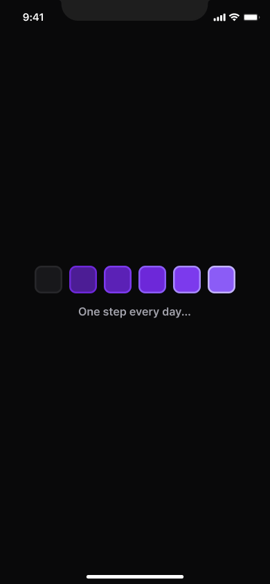
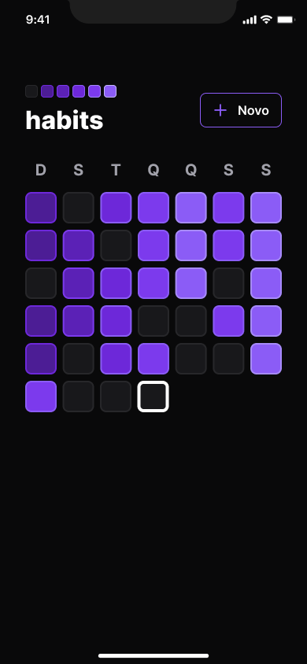
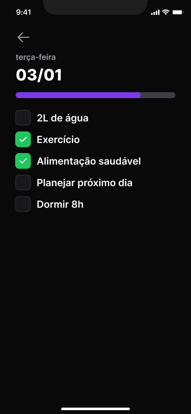
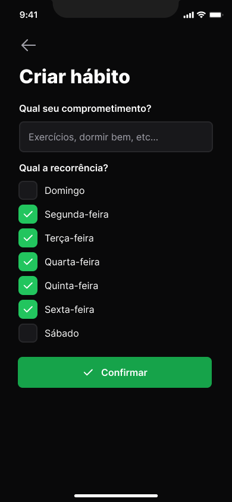
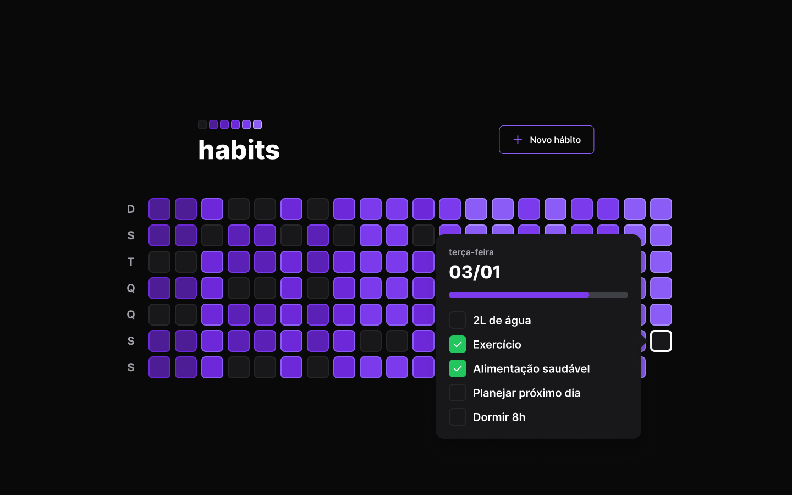
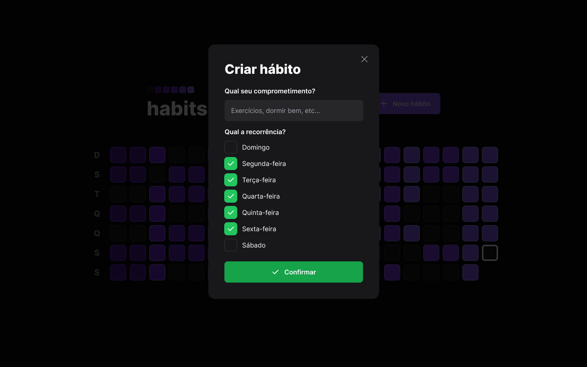

<h1 align="center" id="project_name">
   
  
   
</h1>

Habits tracker

  <!-- GitHub last commit -->
  
  <!-- GitHub language count -->
  
  <!-- GitHub top language -->
  
  <!-- Repository size -->
  
  <!-- Repository status -->
  
  <!-- Link repo -->
  

 <a href="#about">About</a> •
 <a href="#layout">Layout</a> • 
 <a href="#technologies">Technologies</a> • 
 <a href="#author">Autor</a> • 
 <a href="#license">License</a>

  

<h4 align="center">
  	🚧 Habits | Done 🚧
</h4>

<h2 id="about">
💻 About
</h2>

Habits is a habit tracker, a habit tracking tool for the user to put their resolutions and goals into practice, i.e. record actions and track the evolution of the new habits they want to put into their routine.

Project developed during the event NLW Setup of [Rocketseat](https://www.rocketseat.com.br/).

<h2 id="layout">🎨 Layout</h2>

### Mobile

  

  

  

  

  

  

### Web

  

  

 
<h2 id="technologies">🛠 Technologies</h2>

The following tools were used in the construction of the project:

#### Mobile
- **[React Native](https://reactnative.dev/)**
- **[TypeScript](https://www.typescriptlang.org/)**
- **[Expo](https://expo.dev/)**
- **[NativeWind](https://www.nativewind.dev/)**
- **[clsx](https://github.com/lukeed/clsx)**
- **[dayjs](https://github.com/iamkun/dayjs)**

#### Web

- **[React](https://reactjs.org/)**
- **[TypeScript](https://www.typescriptlang.org/)**
- **[Axios](https://axios-http.com/docs/intro)**
- **[Tailwind](https://tailwindcss.com/)**
- **[Radix UI](https://www.radix-ui.com/)**
- **[Vite](https://vitejs.dev/)**
- **[clsx](https://github.com/lukeed/clsx)**
- **[dayjs](https://github.com/iamkun/dayjs)**
- 

#### API

- **[Prisma](https://www.prisma.io/)**
- **[Fastify](https://www.fastify.io/)**
- **[Axios](https://axios-http.com/docs/intro)**
- **[Zod](https://github.com/colinhacks/zod)**
- **[Web Push](https://github.com/web-push-libs/web-push#readme)**
- **[dayjs](https://github.com/iamkun/dayjs)**

> See more [package.json](package.json)

**Utilities**

- IDE: **[Visual Studio Code](https://code.visualstudio.com/)**
- Icons: **[Phosphor Icons](https://phosphoricons.com/)**
- Fonts: **[Inter](https://fonts.google.com/specimen/Inter)**

<h2 id="author">🦸 Autor</h2>
<a href="https://github.com/erik-albuquerque">
 
  
 <b>Érik Albuquerque</b></a>

<h2 id="license">📝 License</h2>

Distributed under MIT license. See [LICENSE](LICENSE) for more information.

Made with ❤️ by Érik Albuquerque 👋🏽 [Contact!](https://www.linkedin.com/in/erik-albuquerque/)

[⬆ Back to top](#project_name) 